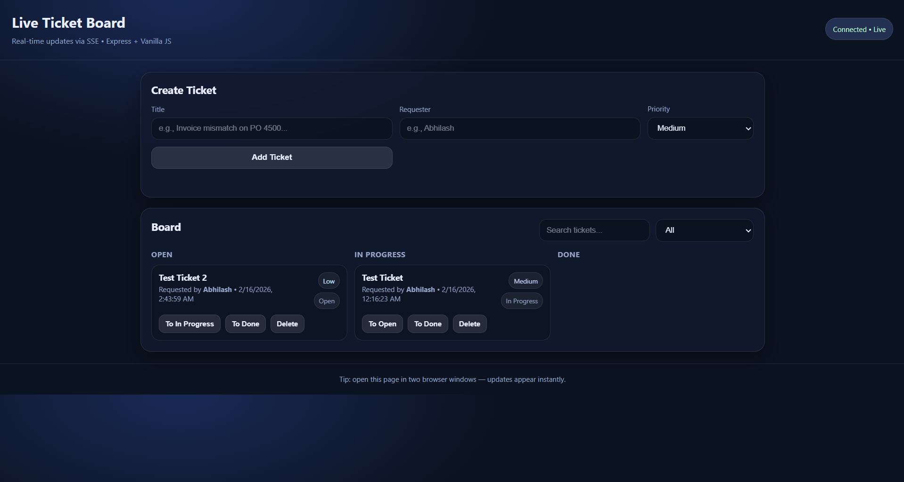

# Live Ticket Board (Express + PostgreSQL + SSE)

A real-time ticket board web app built with Node.js, Express, PostgreSQL, and Server-Sent Events (SSE).

Open the app in two browser windows to see live updates instantly.

## Live Demo
https://live-ticket-board.onrender.com

## Features
- Create tickets (title, requester, priority)
- Move tickets across statuses (Open / In Progress / Done)
- Delete tickets
- Real-time updates via SSE (no refresh required)
- PostgreSQL database persistence

## Screenshot


## Tech Stack
- Frontend: HTML, CSS, Vanilla JS
- Backend: Node.js, Express
- Database: PostgreSQL (Neon for production)
- Realtime: Server-Sent Events (SSE)
- Hosting: Render

## How Real-Time Updates Work (SSE)
This app uses **Server-Sent Events (SSE)** to push updates from the server to all connected clients.
Whenever a ticket is created/updated/deleted, the server broadcasts an event so every browser updates instantly.

## Setup (Local)

### 1. Install dependencies
```bash
npm install
